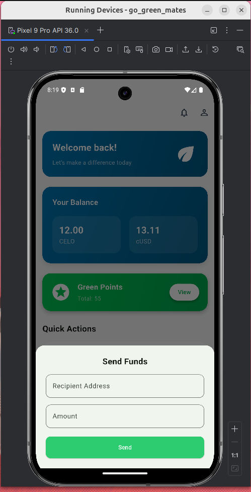
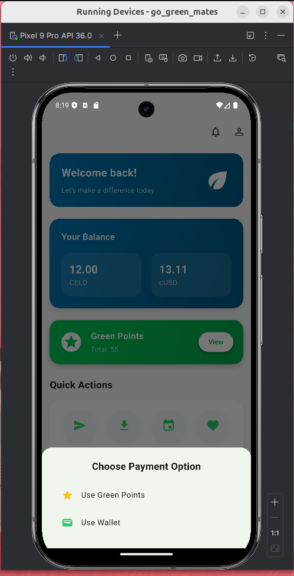

## Grin mates
Grin Mates is a digital platform that empowers and engages individuals and organizations to take real action toward a sustainable planet while they earn. 
Built with Flutter, it bridges global users through eco-friendly campaigns, challenges, and reward systems that turn environmental impact into measurable value.

Through verified partnerships and AI-driven insights, Go Green Mates enables:

Cross-border collaboration on environmental projects

Incentivized green behavior via eco-points and rewards

Real-time engagement in climate campaigns and community drives

Data-backed impact reporting for sponsors and funders

Our mission is to make sustainability engaging, inclusive, and data-driven — inspiring the next generation of environmental changemakers.

## These are some of the screen Shots of Grin Mates

### Splash Screen

### Login Screen

## Home Screen 

## Receive Screen

## Donate Screen

###  Events Screen

###  Events preview Screen

###  Tickets Screen

###  Ticket preview Screen

